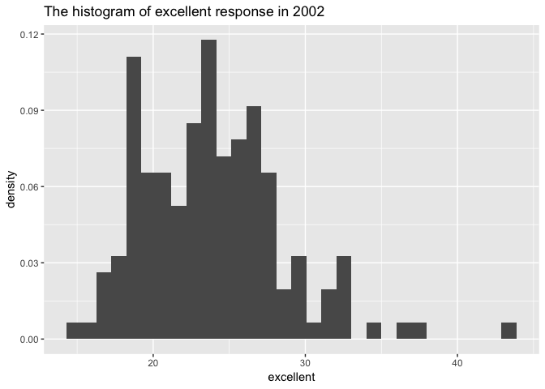
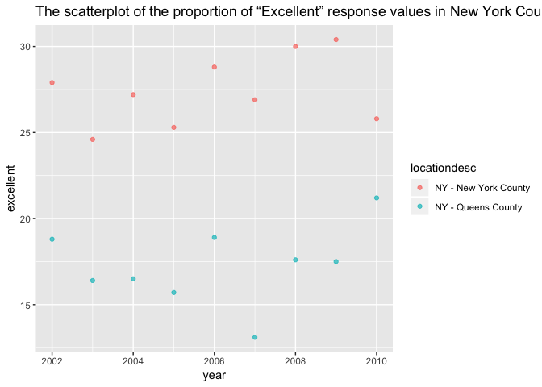

p8105\_hw1\_dz2399
================
DZ
September 29, 2018

Problem 1
---------

#### Read in the data according to instuctions

``` r
df_nyc <- read_csv(file='./data/NYC_Transit_Subway_Entrance_And_Exit_Data.csv') %>%
  janitor::clean_names() %>%
  select(line, starts_with('station'),starts_with('route'),entry, vending,ada,entrance_type) %>% 
  select(-station_location) %>% 
  mutate(entry = recode (entry, 'YES' = T, 'NO'=F))
```

    ## Parsed with column specification:
    ## cols(
    ##   .default = col_character(),
    ##   `Station Latitude` = col_double(),
    ##   `Station Longitude` = col_double(),
    ##   Route8 = col_integer(),
    ##   Route9 = col_integer(),
    ##   Route10 = col_integer(),
    ##   Route11 = col_integer(),
    ##   ADA = col_logical(),
    ##   `Free Crossover` = col_logical(),
    ##   `Entrance Latitude` = col_double(),
    ##   `Entrance Longitude` = col_double()
    ## )

    ## See spec(...) for full column specifications.

``` r
dim(df_nyc)
```

    ## [1] 1868   19

The dataset contains the following variables: line, station\_name, station longitute and latitude, the route that the train serves, entry and entry types, vending, and ada. The data cleaning process is that: firstly, read in the data from the directory and conduct a column-name-cleaning with the function clean\_names; then, select the desired variables; lastly, recode the entry variable with yes equals to T and no to F. The dimension of the resulting dataset is 1868, 19. This is not a tidy data, because the route variables are spreadout to multiple columns rather than a single column.

#### How many distinct stations are there?

``` r
dim(distinct(df_nyc, line,station_name))[1]
```

    ## [1] 465

There are 456 distinct stations in the dataset.

#### How many stations are ADA compliant?

``` r
df_nyc %>% 
  filter(ada==T) %>% 
  distinct(station_name, line) %>% 
  dim()
```

    ## [1] 84  2

There are 84 stations that are ADA compliant in the dataset.

#### What proportion of station entrances / exits without vending allow entrance?

``` r
a <- df_nyc %>% 
  filter(vending=='NO', entry==T) %>% 
  nrow()
b <- df_nyc %>% 
  filter(vending=='NO') %>% 
  nrow()
a/b
```

    ## [1] 0.3770492

Among all entrancss/ exits in the dataset, 9.3% of the entrance/exit do not have vending machines.

#### How many distinct stations serve the A train? Of the stations that serve the A train, how many are ADA compliant?

``` r
df_nyc %>% 
  gather(key=route_number, value=route_name,route1:route11) %>% 
  filter(route_name=='A') %>% 
  distinct(line,station_name) %>% 
  dim()
```

    ## [1] 60  2

``` r
df_nyc %>% 
  gather(key=route_number, value=route_name,route1:route11) %>% 
  filter(route_name=='A',ada==T) %>% 
  distinct(station_name,line) %>% 
  dim()
```

    ## [1] 17  2

Therefore, 60 stations serves the A train in the dataset, and of those 56 stations, 17 stations are APA compliant.

Problem 2
---------

#### Read and clean the Mr. Trash Wheel sheet:

-   specify the sheet in the Excel file and to omit columns containing notes (using the range argument and cell\_cols() function)
-   use reasonable variable names
-   omit rows that do not include dumpster-specific data
-   rounds the number of sports balls to the nearest integer and converts the result to an integer variable (using as.integer)

``` r
df_tw <- readxl::read_excel('./data/HealthyHarborWaterWheelTotals2018-7-28.xlsx',range='A2:N338') %>% 
  janitor::clean_names() %>% 
  filter(!dumpster=='NA') %>% 
  mutate(sports_balls = as.integer(round(sports_balls,0)))
```

#### Read and clean precipitation data for 2016 and 2017.

For each, omit rows without precipitation data and add a variable year. Next, combine datasets and convert month to a character variable (the variable month.name is built into R and should be useful).

``` r
precip_2017 <- readxl::read_excel('./data/HealthyHarborWaterWheelTotals2018-7-28.xlsx', sheet=4, range = 'A2:B15') %>% 
  mutate(year= rep(2017,13)) %>% 
  filter(!Total=='NA', !Month== 'NA') 
  


precip_2016 <- readxl::read_excel('./data/HealthyHarborWaterWheelTotals2018-7-28.xlsx',sheet=5, range = 'A2:B15') %>% 
  mutate(year= rep(2016,13)) %>% 
  filter(!Total=='NA', !Month=='NA')

precip_full <- rbind(precip_2016,precip_2017) %>% 
  mutate(Month = as.factor(Month))
levels(precip_full$Month) <- month.name
precip_full
```

    ## # A tibble: 24 x 3
    ##    Month     Total  year
    ##    <fct>     <dbl> <dbl>
    ##  1 January    3.23  2016
    ##  2 February   5.32  2016
    ##  3 March      2.24  2016
    ##  4 April      1.78  2016
    ##  5 May        5.19  2016
    ##  6 June       3.2   2016
    ##  7 July       6.09  2016
    ##  8 August     3.96  2016
    ##  9 September  4.53  2016
    ## 10 October    0.62  2016
    ## # ... with 14 more rows

The dimension of the Mr. Trash Wheel dataset is 285, 14and the dimension of the combined clean precipitation data for 2016 and 2017 dataset is 24, 3. Take the first line of the Mr. Trash Wheel sheet for example, we would interpret it as on May 16th, 2014, dumpster 1 collected 4.31 tons of trash that had the volume of 18 cubic yards. These trash were consisted of 1450 plastic bottles, 1820 polystyrene, 126000 cigarette butts, 72 glass bottles, 584 grocery bags, 1162 chip bags and 7 sports balls. For some reason, the variable home powered is empty in this dataset, but technically it means that Each ton of trash equates to on average 500 kilowatts of electricity. An average household will use 30 kilowatts per day. For available data, the total precipitation in 2017 was 32.93. The median number of sports balls in a dumpster in 2016 is 26.

Problem 3
---------

``` r
data("brfss_smart2010")
df_brfss <- brfss_smart2010 %>% 
  janitor::clean_names() %>% 
  filter(topic == 'Overall Health') %>% 
  select(-c(class,topic,question,sample_size,confidence_limit_low:geo_location)) %>%
  spread(key=response, value=data_value) %>% 
  janitor::clean_names() %>% 
  mutate(proportion = (excellent+very_good)/(excellent+fair+good+poor+very_good) )
```

#### How many unique locations are included in the dataset? Is every state represented? What state is observed the most?

``` r
df_brfss %>% 
  distinct(locationdesc) %>% 
  dim()
```

    ## [1] 404   1

``` r
df_brfss %>% 
  distinct(locationabbr) %>% 
  dim()
```

    ## [1] 51  1

``` r
sort(table(df_brfss$locationabbr),decreasing = T)[1]
```

    ##  NJ 
    ## 146

-   404 unique locaitons are included in the dataset
-   Since there are 51 states in total, every state is represented in the datset.
-   The most observed state is New Jersy, and it has 146 observations.

#### In 2002, what is the median of the “Excellent” response value?

``` r
df_1 <- df_brfss %>% 
  filter(year==2002) 
median(df_1$excellent,na.rm = T)
```

    ## [1] 23.6

-   In 2002, the median of the excellent response is 23.6.

#### Make a histogram of “Excellent” response values in the year 2002.

``` r
ggplot(df_1, aes(x=excellent, y=..density..))+
  geom_histogram()+
  ggtitle('The histogram of excellent response in 2002')
```

    ## `stat_bin()` using `bins = 30`. Pick better value with `binwidth`.

    ## Warning: Removed 2 rows containing non-finite values (stat_bin).



#### Make a scatterplot showing the proportion of “Excellent” response values in New York County and Queens County (both in NY State) in each year from 2002 to 2010.

``` r
df_2 <- df_brfss %>% 
  filter(locationabbr=='NY') %>% 
  filter(locationdesc=='NY - New York County'|locationdesc=='NY - Queens County') %>% 
  mutate(excellent_proportion = excellent/(excellent+fair+good+poor+very_good))

ggplot(df_2, aes(x=year, y=excellent_proportion,color=locationdesc))+
  geom_point(alpha=0.7)+
  ggtitle('The scatterplot of the proportion of “Excellent” response values in New York County and Queens County from 2002 to 2010.')
```


